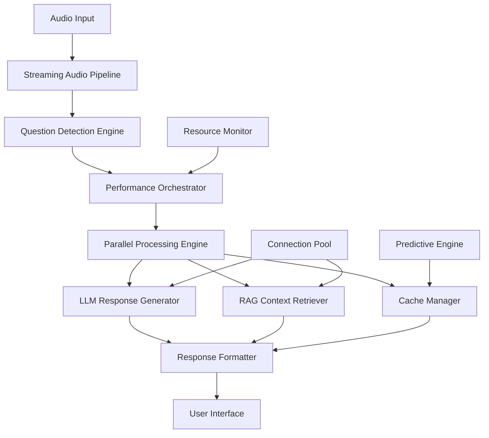

# Design Document

## Overview

This design document outlines a comprehensive optimization strategy for the CueMe application workflow. The optimization focuses on creating a high-performance, multi-threaded architecture that minimizes latency while maintaining accuracy through intelligent caching, predictive processing, and adaptive quality controls. The design leverages modern performance patterns including streaming, parallelization, connection pooling, and smart resource management.

## Architecture

### High-Level Architecture Changes

The optimized architecture introduces several key components:

1. **Performance Orchestrator**: Central coordinator for all optimization strategies
2. **Streaming Audio Pipeline**: Ultra-low latency audio processing with adaptive chunking
3. **Parallel Processing Engine**: Concurrent execution of independent operations
4. **Intelligent Cache Layer**: Multi-tier caching with predictive pre-loading
5. **Connection Pool Manager**: Optimized API connection management
6. **Resource Monitor**: Real-time performance tracking and adaptive adjustments



## Components and Interfaces

### 1. Performance Orchestrator

**Purpose**: Central coordination of all optimization strategies and resource allocation.

**Key Methods**:
```typescript
interface PerformanceOrchestrator {
  optimizeWorkflow(context: WorkflowContext): Promise<OptimizationPlan>
  adaptToSystemLoad(metrics: SystemMetrics): void
  prioritizeTasks(tasks: Task[]): Task[]
  monitorPerformance(): PerformanceMetrics
}
```

**Responsibilities**:
- Coordinate parallel processing strategies
- Adapt quality vs speed trade-offs based on system state
- Manage resource allocation across components
- Implement intelligent task prioritization

### 2. Streaming Audio Pipeline

**Purpose**: Ultra-fast audio processing with adaptive chunking and real-time optimization.

**Key Enhancements**:
```typescript
interface StreamingAudioPipeline {
  processAudioStream(stream: AudioStream): AsyncIterator<AudioChunk>
  adaptiveChunking(audioData: Float32Array): AudioChunk[]
  predictiveProcessing(patterns: AudioPattern[]): void
  optimizeTranscription(chunk: AudioChunk): Promise<TranscriptionResult>
}
```

**Optimizations**:
- Reduce chunk processing time from 2-5 seconds to 500ms
- Implement content-aware adaptive chunking
- Use streaming Whisper API calls where possible
- Pre-warm connections based on audio patterns
- Parallel processing of multiple audio chunks

### 3. Parallel Processing Engine

**Purpose**: Concurrent execution of independent operations to maximize throughput.

**Architecture**:
```typescript
interface ParallelProcessingEngine {
  executeParallel<T>(tasks: Task<T>[]): Promise<T[]>
  createWorkerPool(size: number): WorkerPool
  scheduleTask(task: Task, priority: Priority): Promise<void>
  balanceLoad(workers: Worker[]): void
}
```

**Implementation Strategy**:
- Separate worker threads for audio processing, LLM calls, and RAG searches
- Task queue with priority-based scheduling
- Dynamic worker pool sizing based on system resources
- Load balancing across available workers

### 4. Intelligent Cache Layer

**Purpose**: Multi-tier caching system with predictive pre-loading and smart eviction.

**Cache Hierarchy**:
```typescript
interface IntelligentCacheLayer {
  // L1: In-memory hot cache (most frequent)
  hotCache: Map<string, CacheEntry>
  
  // L2: Session cache (current session context)
  sessionCache: Map<string, CacheEntry>
  
  // L3: Persistent cache (cross-session)
  persistentCache: PersistentStore
  
  // Methods
  get(key: string): Promise<CacheEntry | null>
  set(key: string, value: any, ttl?: number): Promise<void>
  predictivePreload(context: PredictionContext): Promise<void>
  evictIntelligently(): Promise<void>
}
```

**Caching Strategies**:
- Question similarity caching with semantic hashing
- RAG embedding caching with content-based keys
- Response caching with context-aware TTL
- Predictive pre-loading based on user patterns
- LRU eviction with frequency and recency weighting

### 5. Connection Pool Manager

**Purpose**: Optimized API connection management for reduced latency.

**Features**:
```typescript
interface ConnectionPoolManager {
  createPool(endpoint: string, config: PoolConfig): ConnectionPool
  getConnection(endpoint: string): Promise<Connection>
  warmConnections(endpoints: string[]): Promise<void>
  monitorHealth(): PoolHealthMetrics
}
```

**Optimizations**:
- HTTP/2 connection multiplexing
- Keep-alive connections with proper timeout management
- Connection pre-warming based on usage patterns
- Automatic failover and load balancing
- Circuit breaker pattern for failing endpoints

### 6. Predictive Processing Engine

**Purpose**: Anticipate user needs and pre-process likely requests.

**Prediction Strategies**:
```typescript
interface PredictiveEngine {
  analyzeUserPatterns(history: UserAction[]): PredictionModel
  predictNextQuestions(context: ConversationContext): Question[]
  preWarmResources(predictions: Prediction[]): Promise<void>
  updateModel(feedback: UserFeedback): void
}
```

**Implementation**:
- Audio pattern analysis for question prediction
- Context-based RAG pre-fetching
- Mode-specific prompt pre-compilation
- Response template pre-generation
- Resource pre-warming based on usage patterns

## Data Models

### Performance Metrics Model

```typescript
interface PerformanceMetrics {
  audioProcessing: {
    chunkProcessingTime: number
    transcriptionLatency: number
    questionDetectionTime: number
  }
  
  llmProcessing: {
    responseGenerationTime: number
    ragRetrievalTime: number
    cacheHitRate: number
  }
  
  systemResources: {
    memoryUsage: number
    cpuUsage: number
    networkLatency: number
  }
  
  userExperience: {
    endToEndLatency: number
    accuracyScore: number
    satisfactionRating: number
  }
}
```

### Cache Entry Model

```typescript
interface CacheEntry {
  key: string
  value: any
  timestamp: number
  ttl: number
  accessCount: number
  lastAccessed: number
  size: number
  tags: string[]
  priority: CachePriority
}
```

### Optimization Plan Model

```typescript
interface OptimizationPlan {
  audioOptimizations: AudioOptimization[]
  llmOptimizations: LLMOptimization[]
  cacheStrategy: CacheStrategy
  resourceAllocation: ResourceAllocation
  qualityTradeoffs: QualityTradeoff[]
}
```

## Error Handling

### Graceful Degradation Strategy

1. **Audio Processing Failures**:
   - Fallback to larger chunk sizes if real-time processing fails
   - Switch to microphone if system audio capture fails
   - Use cached transcriptions for repeated audio patterns

2. **LLM API Failures**:
   - Fallback to cached responses for similar questions
   - Use alternative API endpoints with load balancing
   - Provide partial responses with status updates

3. **RAG Search Failures**:
   - Timeout-based fallback to non-contextual responses
   - Use cached embeddings when vector search fails
   - Graceful degradation to basic question answering

4. **Resource Exhaustion**:
   - Automatic quality reduction when memory is low
   - Task prioritization when CPU is constrained
   - Connection throttling when network is slow

### Circuit Breaker Implementation

```typescript
interface CircuitBreaker {
  state: 'CLOSED' | 'OPEN' | 'HALF_OPEN'
  failureThreshold: number
  recoveryTimeout: number
  execute<T>(operation: () => Promise<T>): Promise<T>
  onFailure(error: Error): void
  onSuccess(): void
}
```

## Testing Strategy

### Performance Testing Framework

1. **Latency Testing**:
   - End-to-end response time measurement
   - Component-level performance profiling
   - Load testing with concurrent users
   - Network latency simulation

2. **Throughput Testing**:
   - Audio processing capacity testing
   - LLM request rate optimization
   - Cache performance under load
   - Memory usage under stress

3. **Accuracy Testing**:
   - Quality vs speed trade-off validation
   - Cache consistency verification
   - Fallback mechanism accuracy
   - Predictive engine effectiveness

### Benchmarking Targets

- **Audio Processing**: < 500ms chunk processing time
- **Question Detection**: < 100ms algorithmic refinement
- **LLM Response**: < 2 seconds end-to-end
- **Cache Hit Rate**: > 80% for similar questions
- **Memory Usage**: < 200MB baseline, < 500MB peak
- **CPU Usage**: < 5% idle, < 30% active processing

### A/B Testing Framework

```typescript
interface ABTestFramework {
  createExperiment(name: string, variants: Variant[]): Experiment
  assignUser(userId: string, experiment: Experiment): Variant
  trackMetric(metric: string, value: number, variant: Variant): void
  analyzeResults(experiment: Experiment): TestResults
}
```

## Security Considerations

### Performance vs Security Balance

1. **Cache Security**:
   - Encrypt sensitive cached data
   - Implement secure cache eviction
   - Audit cache access patterns
   - Prevent cache timing attacks

2. **Connection Security**:
   - TLS for all API connections
   - Certificate pinning for critical endpoints
   - Secure credential management in connection pools
   - Rate limiting to prevent abuse

3. **Resource Protection**:
   - Prevent resource exhaustion attacks
   - Secure worker thread communication
   - Protect against memory leaks
   - Monitor for unusual resource usage patterns

## Deployment Strategy

### Phased Rollout Plan

**Phase 1: Core Optimizations (Week 1-2)**
- Implement streaming audio pipeline
- Add basic parallel processing
- Deploy intelligent caching layer

**Phase 2: Advanced Features (Week 3-4)**
- Add predictive processing engine
- Implement connection pooling
- Deploy performance monitoring

**Phase 3: Optimization & Tuning (Week 5-6)**
- Fine-tune cache strategies
- Optimize resource allocation
- Implement adaptive quality controls

### Monitoring and Observability

```typescript
interface MonitoringSystem {
  trackPerformanceMetrics(metrics: PerformanceMetrics): void
  alertOnThresholds(thresholds: AlertThreshold[]): void
  generatePerformanceReports(): PerformanceReport
  visualizeMetrics(timeRange: TimeRange): MetricsVisualization
}
```

### Rollback Strategy

- Feature flags for all optimization components
- Gradual traffic shifting with canary deployments
- Automatic rollback triggers based on performance metrics
- Manual rollback procedures for critical issues

This design provides a comprehensive framework for optimizing the CueMe workflow while maintaining the flexibility to adapt to different usage patterns and system constraints. The modular architecture ensures that optimizations can be implemented incrementally and tested thoroughly before full deployment.